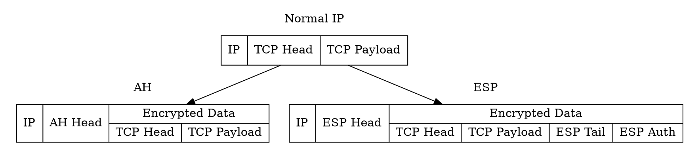
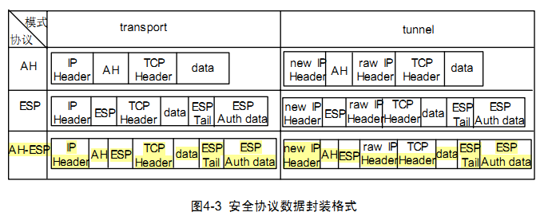
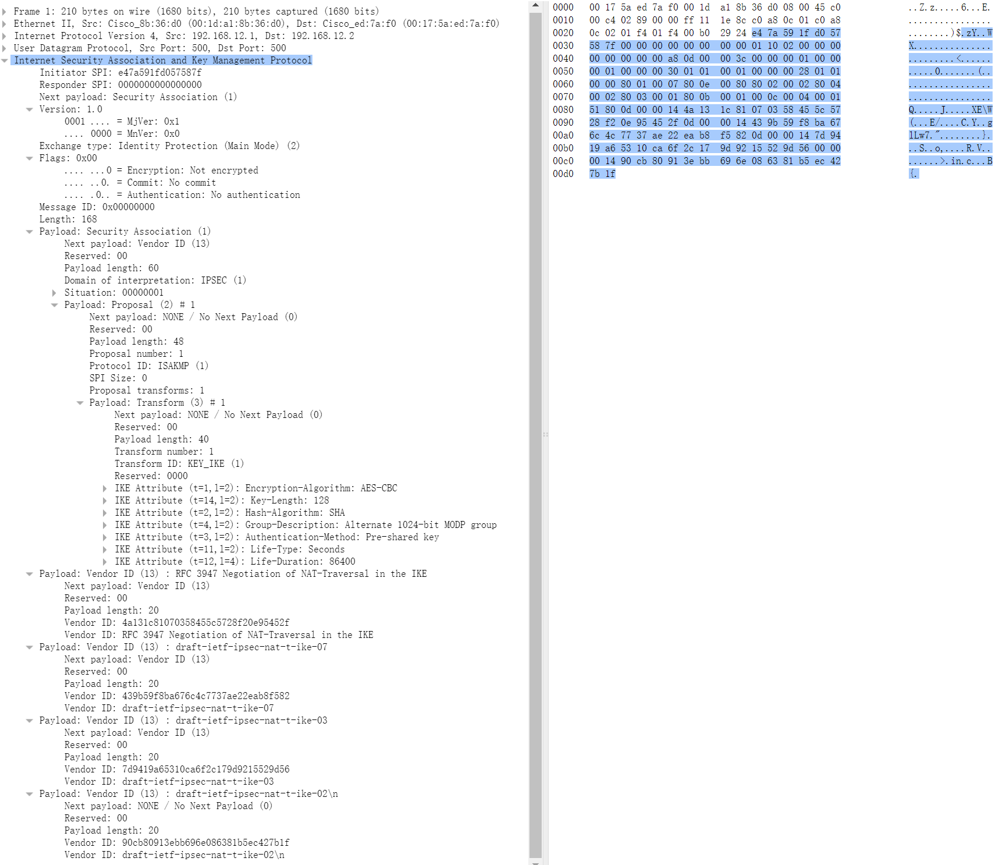
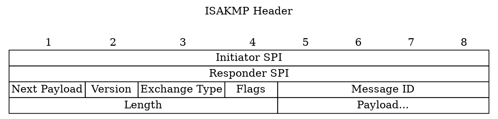
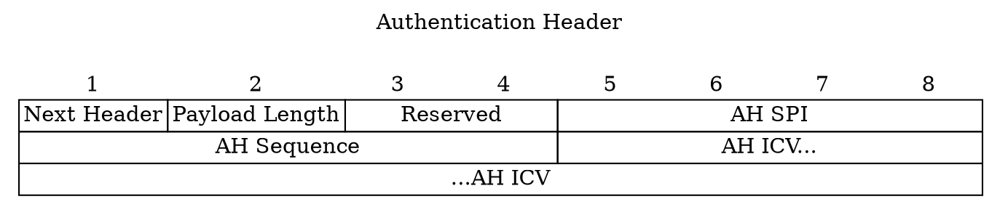
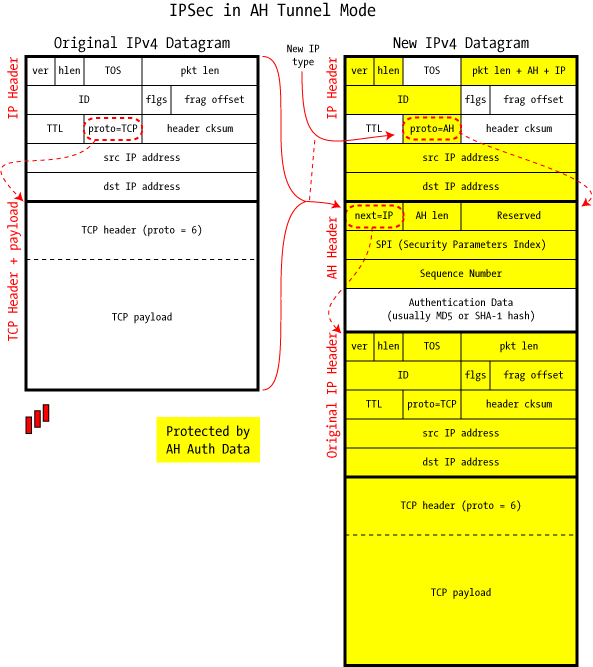
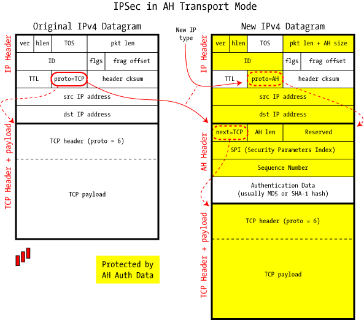
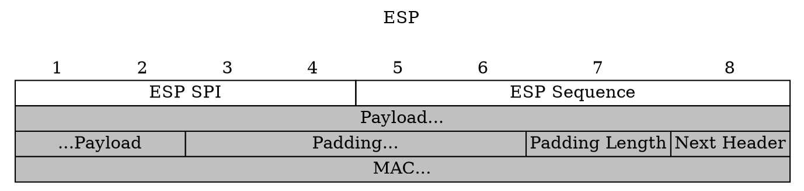
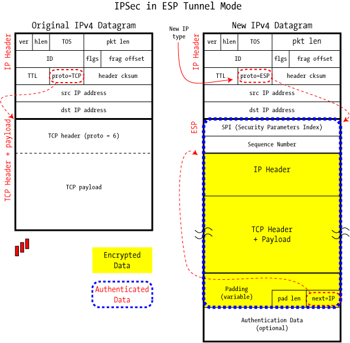
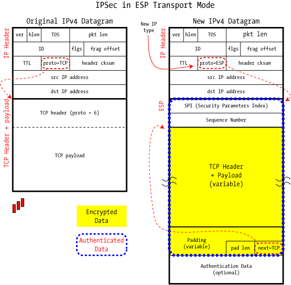

# IPSec 协议簇

首先，IPSec(InternetProtocol Security)不是一个协议，他是一群协议的统称，通过多个协议共同工作，完成了对数据安全性的保护

在 IPSec 中，比较重要的协议包含以下几种

- AH(Authentication Header): 安全协议，在数据包前添加身份验证报文头，实现数据源验证、数据完整性校验、防止报文重放
- ESP(Encapsulating Security Payload): 封装安全负载，在数据包前后添加 ESP 头、ESP 尾，实现加密、数据源验证，数据完整性校验，防止报文重放
- IKE(Internet Key Exchange): 密钥管理交换协议

对于 AH、ESP 在不同模式下，有不同的封装形式

安全传输包含三部分功能

- 对端身份言验证
- 密钥交换
- 加密数据传输

通常，选择 IKE 结合 AH 或 ESP 一种进行传输（AH 的认证强度强于 ESP）

IPSec 中有两种操作模式

- 传输模式: 源主机和目标主机直接执行所有加密操作，加密数据通过 L2TP 创建的单个隧道传输，数据由主机创建，只能由目标主机检索，实现了端到端的安全
- 隧道模式: 除去通信双方主机外，特殊网关也会进行加密处理，隧道在每一跳之间单独建立。

由于 IPSec 是安全的 IP 协议，因此可以认为其实际工作在网络层（通过 UDP 交换密钥）。而由于网络层使用 IP 地址确认通信身份，所以涉及 NAT 地址转换的设备会影响 IPSec 处理，在 IPSec 建立前，需要先探测 NAT 设备[^nat]

## IKE 协议

所有安全相关的协议，重点都在于如何安全地交换密钥。其被称作 SA(Security Association) 安全联盟[^ike2]，表示双方对通信参数的约定，由 `(SPI, srcip, dstip)` 三元组唯一标识。其中 SPI 是一个随机产生 32 比特数值（也可手动设置）。SA 是一个单向协商，只能表明己方对对方的认同，如果要建立双向通信，需要双方均建立起 SA。

在 IPSec 中，共有两种方式建立 SA[^ike]

- 预共享密钥(PSK): 通过线下机制交换，如 U 盾、密码、小纸条，手动设置 SA
- 因特网密钥交换协议(IKE): 使用可靠的协议实现自动维护 SA

前者虽然非常安全，但是非常复杂。密钥需要定期更换，且不同的通信对象之间需要使用不同的密钥，如果纯粹依靠人工，很容易引入新的不安全因素。因此，很多情况下，使用自动的 IKE 协议进行自动协商

在每次发送数据前，需要根据目标地址确定该流量是否已被 IPSec 保护。如果未建立安全协商（或是将要过期），则需要发送 IKE 协商

IKE 协议建立在 ISAKMP 框架上，基于 UDP 协议，默认端口为 `500`，是 IPSec 协议簇的信令协议。IKE 协议目前有两个版本，具体区别如下[^ike3]

|                   |                                                                        IKEv1                                                                         |                IKEv2                 |
| :---------------: | :--------------------------------------------------------------------------------------------------------------------------------------------------: | :----------------------------------: |
| IPSec SA 建立过程 | 分两个阶段，阶段一有主模式和野蛮模式，阶段二为快速模式 主模式+快速模式需要 9 条消息建立 IPSec SA 野蛮模式+快速模式需要 6 条消息建立 IPSec SA | 部分阶段，最少 4 条消息建立 IPSec SA |
|      ISAKMP       |                                                                      13 种类型                                                                       |              17 种类型               |
|     认证方式      |                                                            预共享密钥、数字证书、数字信封                                                            | 预共享密钥、数字证书、数字信封、EAP  |
| IKE SA 完整性算法 |                                                                        不支持                                                                        |                 支持                 |
|        PFS        |                                                                         支持                                                                         |                 支持                 |
|     远程接入      |                                                              通过 L2TP over IPSec 实现                                                               |                 支持                 |

### IKEv1

IKEv1 协商包含两个阶段，分别协商 IKE SA 和 IPSec SA

#### 第一阶段

第一阶段有两种形式: 主模式 和 野蛮模式

完成下述工作:
- 采用何种方式进行验证？（预共享密钥、数字证书）
- 使用哪种加密算法？（DES、AES）
- 使用哪种验证算法？（MD5、SHA1）
- 使用哪种 Diffie-Hellman 参数？
- 使用哪种协商模式
- SA 生存期

**主模式** 共包含三次双向交换，使用六条 ISAKMP 信息，协商过程如下:
1. 发起方 → 响应方: 发送方发送 IKE 安全提议
2. 发送方 ← 响应方: 响应方查找匹配的提议，并发送自己确认的 IKE 提议
3. 发送方 → 响应方: 发送方生成密钥，并发送密钥生成信息
4. 发送方 ← 响应方: 响应方生成密钥，发送密钥生成信息
5. 发送方 → 响应方: 计算出对称密钥，发送身份与验证数据
6. 发送方 ← 响应方: 计算出对称密钥，发送身份与验证数据

可以在网上得到对应 PCAP 文件: [wireshark-capture-ipsec-ikev1-isakmp-main-mode.pcap](https://www.cloudshark.org/captures/ff740838f1c2)

如图，是主模式的第一个包

这里的数据包都是 ISAKMP 包，其结构如下

Initator SPI 在这里根据 IP、时间、端口号等信息生成的随机标识符，用于标识会话唯一性。
在 Exchnge Type 字段，表明了采用主模式交换数据。同时，在 Next Payload 字段，标识下一个数据包的类型是 SA（Payload 部分的第一个数据包）

由于 ISAKMP 是一个通用协议，并非专用于 IPSec，因此在 SA 部分，首先表明了这是用于 IPSec 协商，在其 Payload 字段，声明了使用的各种安全参数:
- 加密算法: AES-CBC
- 密钥长度: 128 位
- 哈希算法: SHA
- ECC 群[^group_description]: 1024 位 MODP 群
- 验证方式: 预共享密钥
- 生存周期单位: 秒
- 生存周期时间: 86400

接下来则发送了多个提议，在这里有:
- RFC 3947 Negitiation of NAT-Traversal in the IKE
- draft-ietf-ipsec-nat-t-ike-07
- draft-ietf-ipsec-nat-t-ike-03
- draft-ietf-ipsec-nat-t-ike-02

第二个数据包与第一个数据包类似，提议部分则选择一种对应的提议作为后面使用的方案（如果都不兼容，则应该拒绝连接）

第三个、第四个数据包则开始进行密钥交换，互相交换密钥交换数据。至此，双方已经成功交换会话密钥，后续信息通过密文发送。

第五个、第六个数据包用于验证密钥是否正确，双方将标识负载和散列负载加密发送，用于检查加密、解密算法的正确性

**野蛮模式** 

野蛮模式与主模式相比，可以更快建立连接，共包含三条消息:
1. 发起方 → 响应方: 发送方发送 IKE 安全提议、密钥生成参数、身份信息
2. 发送方 ← 响应方: 响应方查找匹配的提议，生成密钥和身份验证
3. 发送方 → 响应方: 发送方发送验证数据

### 第二阶段

对于其他加密协议，这一步已经可以建立安全通信了，但是由于 IPSec 并非工作在应用层，前面建立在 UDP 上的安全通信并不能直接用于 IPSec。在这一步，需要建立在网络层的安全连接。

由于已经拥有了 UDP 的安全密钥，因此这里可以借助上一步的安全连接直接进行交换。由于交换很方便、快速，因此这里称为“快速模式”

共包含 3 次通信
1. 发起方 → 响应方: 发送方发送 IPSec 安全提议、身份和验证数据
2. 发送方 ← 响应方: 响应方查找匹配的提议，发送选择的提议与密钥
3. 发送方 → 响应方: 发送方发送密钥与确认信息

第二阶段通过上述方式，完成以下任务:
- 采用哪种封装形式？（AH、ESP）
- 使用哪种加密算法？（DES、AES）
- 使用哪种验证算法？（MD5、SHA1）
- 使用哪种操作模式？（传输模式、隧道模式）
- SA 生存期

### IKEv2

与 IKEv1 相比，IKEv2 支持认证、EAP、NAT 穿越，同时 IKEv2 最少只需要四条消息即可建立安全连接[^ikev2]

1. 发起方 → 响应方: 发送方发送 IKE 安全提议、密钥生成参数、身份信息
2. 发送方 ← 响应方: 响应方查找匹配的提议，生成密钥和身份验证
3. 发送方 → 响应方: 发送方发送身份信息
4. 发送方 ← 响应方：响应方发送身份信息

简单来说，IKEv2 使用两次通信交换了密钥，而后使用两次通信，加密完成了身份验证

这里，第一阶段的 Exchange Type 为 Inital Exchange，第二阶段的快速模式则变为了 CRATE_CHILD_SA

## AH 协议

IP 协议号为 51[^ah_esp]

当通过 AH 协议传输时，IP 的 Payload 部分先是一个 AH 头部

首先是一个一字节头部类型，标明 AH Payload 的类型（原本应该放在 IP 的类型）
接下来是一个字节的 AH 头部长度，而后有 2 字节的保留字段。后面 SPI 为 ESP 的 SPI，Sequence 用于防止重放攻击，ICV 则身份消息验证码。

其中 ICV 通过 IP 报头、AH 报头、IP 负载计算，因此 AH 无法穿越 NAT 设备

在网上可以找到对应的 PCAP 数据包 [wireshark-capture-ipsec-ah-tunnel.pcap](https://www.cloudshark.org/captures/4d1561a5935f)、[wireshark-capture-ipsec-ah-transport.pcap](https://www.cloudshark.org/captures/9c563cd2501e)

下图展现了 AH 是如何修改的原本 IP 报文

## ESP 协议

IP 协议号 50[^ah_esp]

与 AH 相比，ESP 对数据的保护更强
- 第三方无法看到实际的高层协议类型
- 第三方无法看到高层协议长度

在网上可以找到对应的 PCAP 数据包 [wireshark-capture-ipsec-esp-tunnel.pcap](https://www.cloudshark.org/captures/58006657c867)、[wireshark-capture-ipsec-esp-transport.pcap](https://www.cloudshark.org/captures/993215a4a0d9)

下面展现了 ESP 是如何修改原本的 IP 报文

## 参考资料

[^nat]: [如何理解 NAT 使 IPsec 更复杂？ - 车小胖的回答 - 知乎](https://www.zhihu.com/question/21042949/answer/111107581)
[^ike]: [IP 安全与 IPsec 协议，理论与实践 VI ：IPsec IKE 协商 - LogicJitterGibbs 的文章 - 知乎](https://zhuanlan.zhihu.com/p/100410283)
[^ike2]: [IPSec VPN 之 IKE 协议详解 - 曹世宏的博客](https://cshihong.github.io/2019/04/03/IPSec-VPN%E4%B9%8BIKE%E5%8D%8F%E8%AE%AE%E8%AF%A6%E8%A7%A3/)
[^ikev2]: [IPSec VPN之 IKEv2 协议详解 - 曹世宏的博客](https://cshihong.github.io/2019/04/09/IPSec-VPN%E4%B9%8BIKEv2%E5%8D%8F%E8%AE%AE%E8%AF%A6%E8%A7%A3/)
[^ike3]: [IKEv1 和 IKEv2 对比，场景和原理](https://bbs.huaweicloud.com/blogs/198567)
[^group_description]: [IPSec Group Description](https://www.iana.org/assignments/ipsec-registry/ipsec-registry.xhtml#ipsec-registry-8)
[^ah_esp]: [AH 协议与 ESP 协议简析](https://blog.csdn.net/bytxl/article/details/16825251)