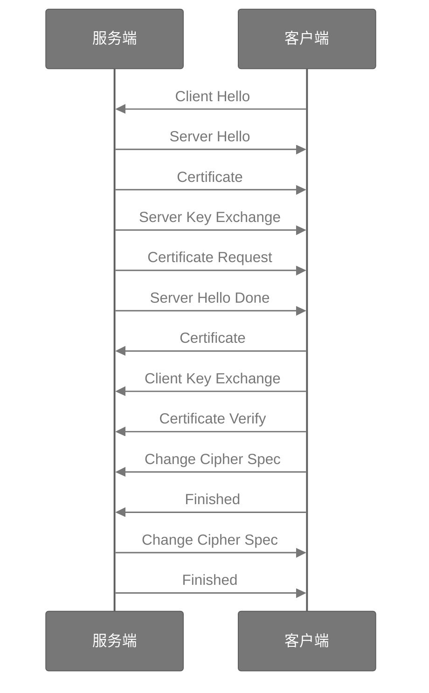

# TLS 协议流程

SSL/TLS 是最常用加密传输协议，其运行在 TCP 之上，应用层之下，可以提供加密安全通信，第三方无法获知通信的实际内容。
在 SSL 3 之后，更名为 TLS

## TLS 记录协议

记录协议是 TLS 的基础，可以认为关系如下: TLS 高层协议 -> TLS 记录协议 -> TCP

TLS 记录协议是对 TLS 高层协议的一个简单封装，数据格式如下

<table style="text-align:center">
<tr><td>内容类型</td><td>主要版本</td><td>次要版本</td><td>数据长度</td></tr>
<tr><td colspan="4">数据内容</td></tr>
<tr><td colspan="4"><del>消息验证码</del></td></tr>
</table>

```c
 enum {
    invalid(0),
    change_cipher_spec(20),
    alert(21),
    handshake(22),
    application_data(23),
    (255)
} ContentType;

struct {
    ContentType type;
    ProtocolVersion legacy_record_version;
    uint16 length;
    opaque fragment[TLSPlaintext.length];
} TLSPlaintext;
```

- 内容类型: 1 字节，记录了里层协议（高层协议）的类型[^tls1.3]：
  - `0`: 非法字段
  - `20`: 密钥交换协议(change_cipher_spec)
  - `21`: 告警协议(alert)
  - `22`: 握手协议(handshake)
  - `23`: 应用层数据(application_data)
- 主要版本: 1 字节，一般为 `0x03`，代表 SSL 3
- 次要版本: 1 字节，根据版本不同可能为 `0x01`、`0x02`、`0x03`，分别代表 TLS 1.1、TLS 1.2、TLS 1.3（从这里也体现了 TLS、SSL 的一脉相传）
- 数据长度: 2 字节
- 消息验证码: 在很多地方提到记录层协议存在消息验证码字段，占 0、16、20 位长度

## TLS 高层协议

### 握手协议

握手阶段使用 TLS 握手协议实现，握手协议格式如下

- 握手类型: 1 字节
  - `1`: 客户端问候(client_hello)
  - `2`: 服务端问候(server_hello)
  - `4`: 新会话(new_session_ticket)
  - `5`: 早期数据结束(end_of_early_data)
  - `8`: 加密插件(encrypted_extensions)
  - `11`: 证书(certificate)
  - `13`: 证书请求(certificate_request)
  - `15`: 证书验证(certificate_verify)
  - `20`: 握手结束(finished)
  - `24`: 密钥更新(key_update)
  - `254`: 消息哈希(message_hash)
- 长度: 3 字节
- 内容

根据不同的子协议，其格式会有不同

```c
 enum {
    client_hello(1),
    server_hello(2),
    new_session_ticket(4),
    end_of_early_data(5),
    encrypted_extensions(8),
    certificate(11),
    certificate_request(13),
    certificate_verify(15),
    finished(20),
    key_update(24),
    message_hash(254),
    (255)
} HandshakeType;

struct {
    HandshakeType msg_type;    /* handshake type */
    uint24 length;             /* remaining bytes in message */
    select (Handshake.msg_type) {
        case client_hello:          ClientHello;
        case server_hello:          ServerHello;
        case end_of_early_data:     EndOfEarlyData;
        case encrypted_extensions:  EncryptedExtensions;
        case certificate_request:   CertificateRequest;
        case certificate:           Certificate;
        case certificate_verify:    CertificateVerify;
        case finished:              Finished;
        case new_session_ticket:    NewSessionTicket;
        case key_update:            KeyUpdate;
    };
} Handshake;
```

整个握手阶段的流程如下



#### Client Hello

请求必定是从客户端开始发起，因此第一步必定是客户端发出的 Hello 消息。

Client Hello 属于 TLS 记录协议的一种，因此其外层必然是

在这一步，客户端需要告诉服务端，自己的版本、支持的组件等信息

在原本的握手协议后，Client Hello 还有如下部分:
- 版本: 2 字节，包含主版本和次要版本
- 随机数: 32 字节，其中有 4 字节时间戳
- 会话长度: 1 字节
- 会话 ID
- 加密套件个数: 2 字节
- 加密套件列表: 每个套件 2 字节
- 压缩方式个数: 1 字节
- 压缩方式列表: 每个方法 1 字节
- 插件个数: 2 字节
- 插件列表:
    - 插件类型: 2 字节
    - 长度: 2 字节
    - 内容

如果是首次建立连接，这里的会话 ID 为空。而如果在一定时间内曾经建立过连接，双端将会缓存对应的信息，并复用之前的参数，这种不需要全部握手的形式，称为 **SSL 会话恢复**

#### Server Hello

当服务端收到客户端的问候后，需要返回自己的问候。从对于客户端支持的参数列表，服务端需要选择最安全的一个。如果某一个参数的列表在服务端均不支持，服务端无法支持，则需要返回握手失败

再次讨论前面提到的 **SSL 会话恢复**，这里存在一个问题[^caoshihong]: 对于大流量的服务端，它们需要维护一个超大的会话列表。由于该部分是协议层的限制，难以进行优化。
为了解决该问题，可以使用 Session Ticket 将相关数据存储在客户端，由于内容由服务端进行加密，因此不会存在数据的泄露。

到这一步通信双端已经确定了后面需要使用哪些加密套件，以及相关的前置参数（两个随机数）

#### 证书

SSL/TLS 体系服务端需要一个 [X.509 证书](#x509) 来验证自己的身份

通常而言，证书链的根证书，应该是所有人公认的根证书。根证书一般不直接签发通信用的证书，而是签发一些二级证书用于签发通信证书。在通信过程中，应该把除去根证书的证书链一起随着请求发送，以供对端验证。

到了这一步，客户端可以认为服务端是自己真正要请求的服务端，不是其他第三方假冒的（身份的确认，需要使用证书中的域名、ip 等信息）

#### 服务端密钥交换

在前面的问候步骤，已经确定了使用的各种算法，在这里使用对应的方式(RSA、DH)以及两个随机数，进行密钥交换

如果使用 DH 密钥交换，对于每种特定的计算方式，都有固定的基数[^ec_params]，如对于常见的 `secp256r1`，未压缩的 $G$ 为
```
04 
6B17D1F2 E12C4247 F8BCE6E5 63A440F2 
77037D81 2DEB33A0 F4A13945 D898C296 
4FE342E2 FE1A7F9B 8EE7EB4A 7C0F9E16 
2BCE3357 6B315ECE CBB64068 37BF51F5
```

而压缩后的 $G$ 为
```
03 
6B17D1F2 E12C4247 F8BCE6E5 63A440F2 
77037D81 2DEB33A0 F4A13945 D898C296
```

服务端根据设定好的基数，计算出公钥与私钥，将选取的曲线（或其他参数）以及公钥发送给客户端

#### 客户端证书请求

如果服务端还需要验证客户端身份，后续服务端需要发送 “Certificate Request” 要求进行证书请求

告诉客户端自己支持的证书类型，以及支持的根证书列表

#### 服务端问候结束

至此，服务端问候结束

#### 客户端证书

如果需要发送客户端证书，则客户端需要与服务端按照一样的步骤发送证书，并由服务端进行验证

#### 客户端密钥交换

与服务端相同，客户端使用相同的参数计算出自己的公钥与私钥，并将公钥发送至对方

#### 密钥交换协议

当双方协商密钥完成，客户端需要发送 [密钥协商协议](#change_cipher_spec)，声明自己已经切换到协商好的加密套件，后续使用新的加密套件进行加密传输

#### 客户端结束

握手阶段结束前，客户端需要发送 Client Finished 通知（使用协商好的加密套件加密）

#### 服务端结束

针对客户端结束的回应，服务端需要发送服务端结束（还需要发送一个 [密钥协商协议](#change_cipher_spec)，告知客户端加密套件切换）

<a name="change_cipher_spec"></div>

### 密钥交换协议

密钥交换协议用于通知对端自己已经准备好切换到新的协议，该协议只有一个字节。但由于其实际上是冗余数据，因此在 TLS 1.3 已经被移除了

### 告警协议

告警协议是一个告诉对方自己发生错误，不会再接收数据的通知协议

```c
  enum { warning(1), fatal(2), (255) } AlertLevel;
  
  struct {
      AlertLevel level;
      AlertDescription description;
  } Alert;
  ```

### 应用协议

实际要发送的数据存在于应用协议内加密发送

原本的应用层协议将会分段、计算 MAC、加密 后传输

<a name="x509"></a>

## X.509 证书

通常，证书以 `.cer` 格式存储，可以使用 `openssl` 查看证书内容
```bash
openssl x509 -in F2giRo29iMlijZg5U.cer -inform der -text -noout
```

一个证书包含如下关键信息
- 签发者
- 使用者
- 签发时间
- 过期时间
- 序列号
- 签名算法
- 加密算法

要验证一个证书，需要递归地执行下述操作:
1. 查看该证书是否过期？
2. 如果证书未过期，查看签发者是否在信任的证书列表内
3. 如果签发者在信任的证书列表内，则使用对应证书公钥验证该证书合法性；如果不在信任列表内，则需要从 1 开始检查该证书链的上一个证书（由服务端一起发送）
4. 检查证书序列号是否在过期列表内

## 密钥交换

### RSA 密钥

由于公私钥本身可以确保安全性，客户端在选定一个对称密钥密码后，可以使用证书中的公钥加密对称密码，传送给服务端后，服务端使用自己的私钥解密

在 RSA 体系本身安全的前提下，该方案可以确保安全性


### Diffie-Hellman 密钥交换

如果不需要考虑身份验证，采用 Diffie-Hellman 可以在不安全信道进行密钥的交互

通信双方交换一个公共的基数 $G$，素数 $p$，而后双方分别设定一个随机数 $a$ 和 $b$
双方交换自己的公共信息 $A = (g^{a} \mod p)$ 和 $B = (g^{b
} \mod p)$

这样，双方可以使用对方的数据计算出一个相同的对称密钥 $s = B^a \mod p = A^b \mod p$

由于 $p$ 是一个很大的素数，而求解离散对数非常复杂，因此即使被第三方观测到，仍然可以保证安全

但 Diffie-Hellman 体系本身不能确保身份验证，因此通常还需要 RSA 的配合

为了进一步增加计算难度，还有基于椭圆曲线的 Diffie-Hellman，简称 EC-DH


## 参考资料

[^tls1.3]: [RFC 8446: tls 1.3](https://www.rfc-editor.org/rfc/inline-errata/rfc8446.html)
[^caoshihong]: [曹世宏的博客 - SSL/TLS协议详解](https://cshihong.github.io/2019/05/09/SSL%E5%8D%8F%E8%AE%AE%E8%AF%A6%E8%A7%A3/)
[^ec_params]: [Recommended Elliptic Curve Domain Parameters](http://www.secg.org/sec2-v2.pdf)